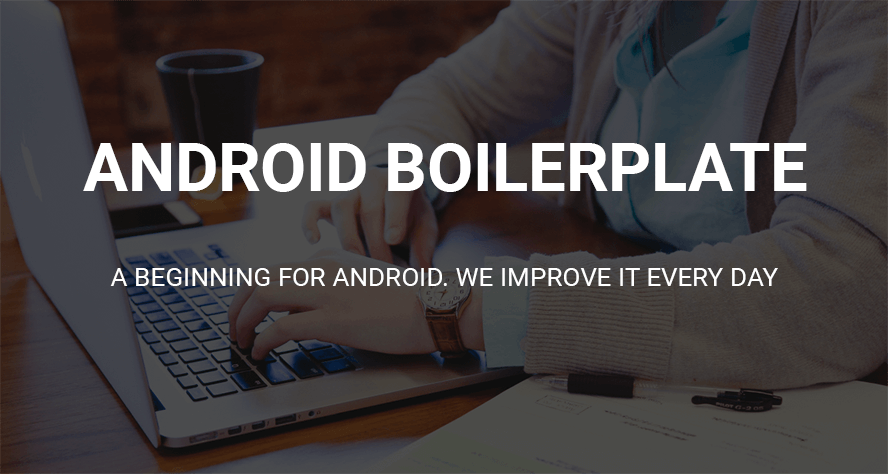
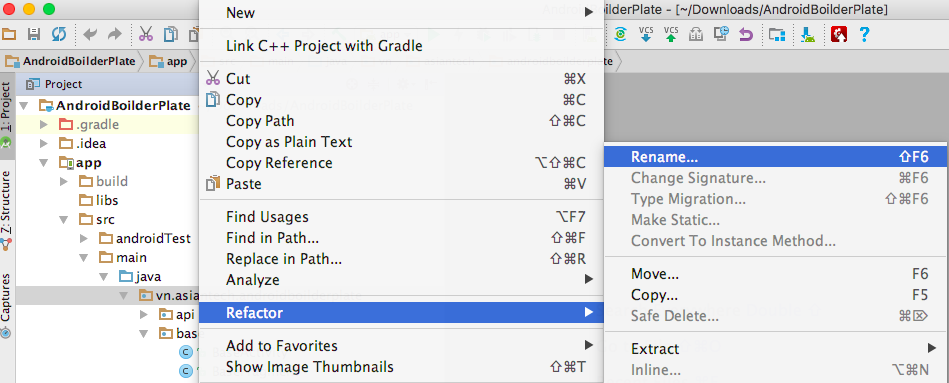
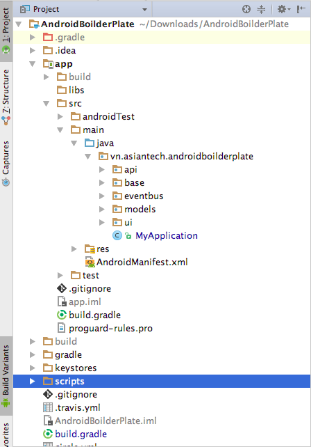

AT-Android-Boilerplate
-----------------

[](https://travis-ci.org/at-kietvo/AT-Android-Boilerplate-Simply)




***
The AT-Android-Boilerplate constains the source code support networking, download image, `annonation`, synching data with `RxJava` - `RxAndroid` and integrate `Circle CI`, `Travis CI`. It's simply for beginer learning base of Android Project in AT.

Table of Contents
-----------------
- [What we do](#what-we-do)
- [Features](#features)
- [Prerequisites](#prerequisites)
- [Beginning Android Project](#beginning-android-project)
- [Project Structure](#project-structure)
- [Sample](#sample)
- [Contributing](#contributing)
- [License](#license)

What we do
-----------------
- Add library, tools support to `android project`.
- Integrate Circle CI, Travis CI.

Features
-----------------
- [Retrofit 2.2.0](https://github.com/square/retrofit)
- [Picasso 2.5.2](https://github.com/square/picasso)
- [Android Annontations 3.2](https://github.com/androidannotations/androidannotations)
- [RxJava and RxAndroid 2.x](https://github.com/ReactiveX/RxAndroid)
- [Otto](https://github.com/square/otto) (Deprecated using RxJava instead, see [here](http://blog.kaush.co/2014/12/24/implementing-an-event-bus-with-rxjava-rxbus/))
- [Circle CI](https://circleci.com/)
- [Travis CI](https://travis-ci.org/)
- `Checkstyle`, `PMD` and `Findbugs` for code analysis.

Prerequisites
-----------------
- **OS** : `Mac OS`, `Linux`, `Windows`.
- **SDK** :  Android SDK 25 and above.
- **IDE** : Android Studio 2.3 and above.
- **Enviroment** : Java JDK 1.8 and above.

Beginning Android Project
-----------------
If you guys want to create new project with this boilerplate, you must follow this steps one by one:

- Clone this repository from GitHub via `command line` or `download` from GitHub page.

	```bash
	# Get the latest snapshot
	git clone https://github.com/at-kietvo/AT-Android-Boilerplate-Simply `YourProjectName`
	```
- Import that project to `Android Studio` IDE.
	
- Rename some information related with `your project`.

	- `packagename`, default `vn.asiantech.androidboilderplate`.
	
		- Right click to package in project tools.
		
				
		- Refactor -> Rename -> Choosing rename package.
		
	- `applicationId` in `build.gradle`
	
		> /app/build.gradle
	- `AndroidManifest.xml`

		> /src/main/AndroidManifest.xml
	- `proguard-rules.pro`
		
		> /app/proguard-rules.pro

- Enjoy Boilerplate with your life coding.

Project Structure
-----------------
- See structure of project tree.

	
	
- Resource structure

	| Name         | Path                      | Description |
	| --------     | -----------               | ----------- |
	| XML Layouts  | `res/layout/`             | This is where we put our XML layout files.     |
	| XML Menus    | `res/menu/`               | This is where we put our AppBar menu actions.  |
	| Drawables    | `res/drawable`            | This is where we put images and XML drawables. | 
	| Colors       | `res/values/colors.xml`   | This is where we put [color definitions](http://developer.android.com/guide/topics/resources/more-resources.html#Color). |
	| Dimensions   | `res/values/dimens.xml`   | This is where we put [dimension values](http://developer.android.com/guide/topics/resources/more-resources.html#Dimension). | 
	| Strings      | `res/values/strings.xml`  | This is where we put strings.           |
	| Styles       | `res/values/styles.xml`   | This is where we put style values.      |

Sample
-----------------
- Clone this project.
- Build and run to see `sample`.

Contributing
------------
For bugs, questions and discussions please use the **Github Issues**.

Thank you to all the contributors on this project. Your help is much appreciated.

License
-------
```
MIT License

Copyright (c) 2017 Asiantech Co., Ltd

Permission is hereby granted, free of charge, to any person obtaining a copy
of this software and associated documentation files (the "Software"), to deal
in the Software without restriction, including without limitation the rights
to use, copy, modify, merge, publish, distribute, sublicense, and/or sell
copies of the Software, and to permit persons to whom the Software is
furnished to do so, subject to the following conditions:

The above copyright notice and this permission notice shall be included in all
copies or substantial portions of the Software.

THE SOFTWARE IS PROVIDED "AS IS", WITHOUT WARRANTY OF ANY KIND, EXPRESS OR
IMPLIED, INCLUDING BUT NOT LIMITED TO THE WARRANTIES OF MERCHANTABILITY,
FITNESS FOR A PARTICULAR PURPOSE AND NONINFRINGEMENT. IN NO EVENT SHALL THE
AUTHORS OR COPYRIGHT HOLDERS BE LIABLE FOR ANY CLAIM, DAMAGES OR OTHER
LIABILITY, WHETHER IN AN ACTION OF CONTRACT, TORT OR OTHERWISE, ARISING FROM,
OUT OF OR IN CONNECTION WITH THE SOFTWARE OR THE USE OR OTHER DEALINGS IN THE
SOFTWARE.
```
